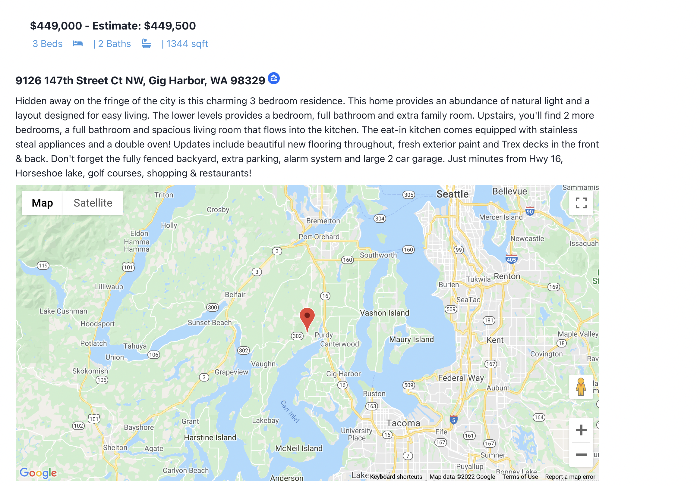
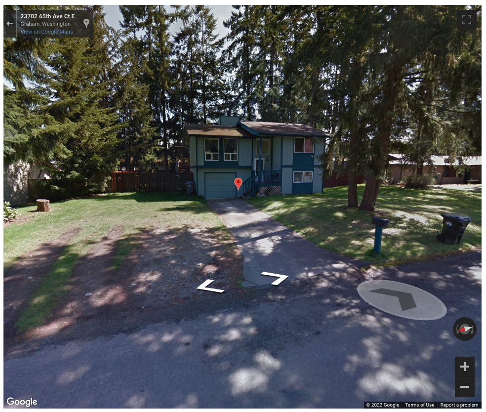

<div id="top"></div>


<br />
<div align="center">
  <a href="https://homedirection.org" target="_blank">
    
  </a>

  <h3 align="center">Find USDA Eligible Homes with Ease!</h3>

  <p align="center">
    <a href="https://usda-homes.vercel.app/search">View Demo</a>
    ·
    <a href="https://github.com/islamjamil/usda_homes/issues">Report Bug</a>
    ·
    <a href="https://github.com/islamjamil/usda_homes/issues">Request Feature</a>
  </p>
</div>


<!-- TABLE OF CONTENTS -->
<details>
  <summary>Table of Contents</summary>
  <ol>
    <li>
      <a href="#about-the-project">About The Project</a>
      <ul>
        <li><a href="#built-with">Built With</a></li>
      </ul>
    </li>
    <li>
      <a href="#getting-started">Getting Started</a>
      <ul>
        <li><a href="#prerequisites">Prerequisites</a></li>
        <li><a href="#installation">Installation</a></li>
      </ul>
    </li>
    <li><a href="#usage">Usage</a></li>
    <li><a href="#roadmap">Roadmap</a></li>
    <li><a href="#license">License</a></li>
    <li><a href="#contact">Contact</a></li>
    <li><a href="#gallery">Gallery</a></li>
  </ol>
</details>


<!-- ABOUT THE PROJECT -->
## About The Project

[![Product Name Screen Shot][product-screenshot]](https://usda_homes.vercel.app/search)

Individuals using [USDA Single Family Housing Direct Loans](https://www.rd.usda.gov/programs-services/single-family-housing-programs/single-family-housing-direct-home-loans) are required to purchase homes in [designated rural areas](https://eligibility.sc.egov.usda.gov/eligibility/welcomeAction.do?pageAction=sfp). Traditionally, sites like Zillow or Redfin would be used to find desired houses, and the eligibility of the homes would be individually verified. My project USDA Home Search solves this problem by allowing users to search through eligible homes in their approved county that match their desired criteria (square footage, price, etc.)

<p align="right">(<a href="#top">back to top</a>)</p>


### Built With

* [Next.js](https://nextjs.org/)
* [React.js](https://reactjs.org/)
* [D3.js](https://d3js.org/)
* [Axios](https://axios-http.com/)
* [NodeJS](https://nodejs.org/en/)
* [Unofficial Zillow API](https://rapidapi.com/apimaker/api/zillow-com1/)
* [Google Maps Javascript API (for React)](https://react-google-maps-api-docs.netlify.app/)
* [Chakra UI](https://chakra-ui.com/)
* [React Responsive Carousel](https://www.npmjs.com/package/react-responsive-carousel)


<p align="right">(<a href="#top">back to top</a>)</p>


<!-- GETTING STARTED -->
## Getting Started

Follow these steps to get your own local copy of USDA Home Search running locally

### Prerequisites

* npm
  ```sh
  npm install npm@latest -g
  ```

### Installation

1. Get a [Google Maps API Key](https://developers.google.com/maps) and a [Real Estate API Key](https://rapidapi.com/apimaker/api/zillow-com1/)
2. Clone the repo
   ```sh
   git clone https://github.com/islamjamil/usda_homes.git
   ```
3. Install NPM packages
   ```sh
   npm install
   ```
4. Enter your API keys in `next.config.js`
   ```js
    env: {
      rapid_api_key: "YOUR API KEY",
      google_maps_api_key: "YOUR API KEY"
    }
   ```

<p align="right">(<a href="#top">back to top</a>)</p>


<!-- USAGE EXAMPLES -->
## Usage

  Start a development server
  ```sh
  npm run dev
  ```
  Build a production version
  ```
  npm run build
  ```
  Run your production build
  ```
  npm run start
  ```

<p align="right">(<a href="#top">back to top</a>)</p>


<!-- ROADMAP -->
## Roadmap

- [ ] Add support for all counties in the United States (only half are supported currently)
- [ ] Display Home Prices in Google Maps Markers
- [ ] Recode the Map component to use the Google Maps API in a more "reactful" way
- [ ] Highlight property on the map when hovering over the property's thumbnail
- [ ] Add automatic [price maximum](https://www.rd.usda.gov/files/RD-SFHAreaLoanLimitMap.pdf) per county
- [ ] Off load the counties dictionary into a better format

<p align="right">(<a href="#top">back to top</a>)</p>


<!-- LICENSE -->
## License

Distributed under the MIT License. See `LICENSE.txt` for more information.

<p align="right">(<a href="#top">back to top</a>)</p>


<!-- CONTACT -->
## Contact

Jamil Islam - [jamilislam.com](jamilislam.com) - ijamil101@gmail.com

Project Link: [https://github.com/islamjamil/usda_homes](https://github.com/islamjamil/usda_homes)

<p align="right">(<a href="#top">back to top</a>)</p>


## Takeaways from this Project

* NextJS > Create React App (not even an argument)
* D3 is a very powerful library
* Vercel > Github Pages (Deployments per commit :) and better and even custom urls)

## Gallery
* [Ocean County, NJ](https://usda_homes.vercel.app/search?county=Ocean+County%2C+NJ)  

* [Home in Gig Harbor, WA](https://usda_homes.vercel.app/property/63276302)  



* [Marker indicating the home in Google Maps Street View](https://usda_homes.vercel.app/property/49299225)  



<!-- MARKDOWN LINKS & IMAGES -->
[product-screenshot]: md_images/USDA_Home_Search_example.png
